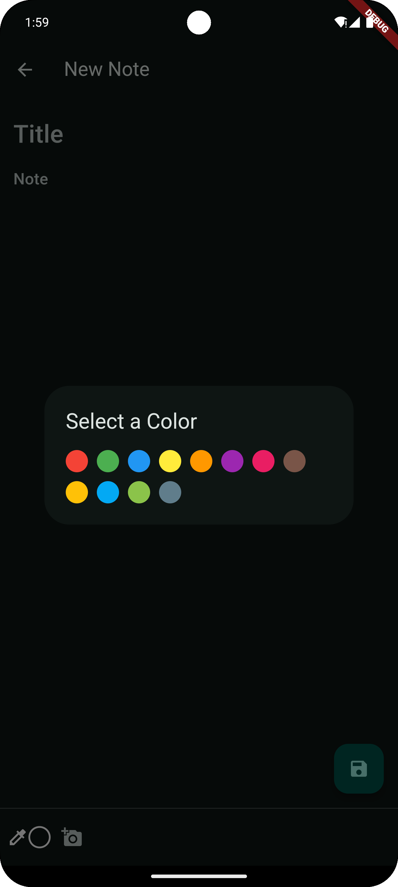

# Flutter Notes App

This is a Flutter-based notes application that allows users to create, view, edit, and delete notes. It leverages a local database for data persistence and is built with modular architecture.

## Table of Contents

- [Features](#features)
- [Getting Started](#getting-started)
- [Prerequisites](#prerequisites)
- [Installation](#installation)
- [Running the App](#running-the-app)
    - [Running on Android Studio](#running-on-android-studio)
    - [Running on Visual Studio Code](#running-on-visual-studio-code)
- [Screenshots](#screenshots)
- [Project Structure](#project-structure)
- [License](#license)

## Features

- **Create Notes**: Add new notes with a title, content, color, and optional image.
- **Edit Notes**: Update previously saved notes with new text, color, or image.
- **Delete Notes**: Remove notes when no longer needed.
- **Search Notes**: Quickly find notes by title or content.
- **Color Selection**: Customize note appearance with a selection of colors.
- **Image Attachments**: Upload images from the gallery or take new photos for each note.

## Getting Started

To get a local copy of this project up and running, follow these steps.

### Prerequisites

- **Flutter SDK**: [Install Flutter](https://flutter.dev/docs/get-started/install) (version 2.x or above).
- **Android Studio** or **Visual Studio Code** with the Flutter and Dart plugins.

### Dependencies

-   **sqflite**: SQLite database for Flutter.
-   **path**: Provides common path manipulation utilities.
-   **image_picker**: For selecting and capturing images.

### Installation

1. Clone this repository:
   ```bash
   git clone https://github.com/okikio-school/mobile-app-labs
   cd Lab4
   cd note_me_v2
   ```

2. Install dependencies:
   ```bash
   flutter pub get
   ```

## Running the App

### Running on Android Studio

1. Open Android Studio.
2. Click on `Open an existing project` and select the cloned repository folder.
3. Make sure your device (emulator or physical device) is selected.
4. Click on the **Run** button or use the shortcut `Shift + F10` to start the app.

### Running on Visual Studio Code

1. Open the project folder in Visual Studio Code.
2. Ensure that the Flutter and Dart plugins are installed.
3. Connect your device or start an emulator.
4. Press `F5` or go to `Run > Start Debugging` to launch the app.

## Screenshots

| Home Screen       | New Note Screen      | Note Details       |
|-------------------|----------------------|--------------------|
|  |  |  |
|  |  |  |


## Project Structure

```
lib
│
├── models
│   └── note_model.dart               # Data model for notes
│
├── screens
│   ├── widgets
│   │   └── note_card.dart            # Widget to display individual notes in a card format
│   │
│   ├── home_screen.dart              # Displays the list of saved notes
│   ├── new_notes_screen.dart         # Interface for creating new notes
│   └── note_view.dart                # Detailed view of a selected note
│
└── main.dart                         # Main entry point of the application
```

## License

This project is licensed under the MIT License.

---
